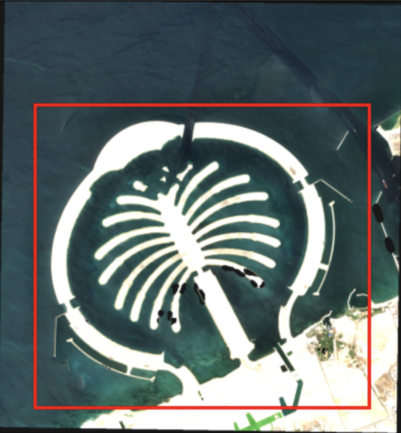
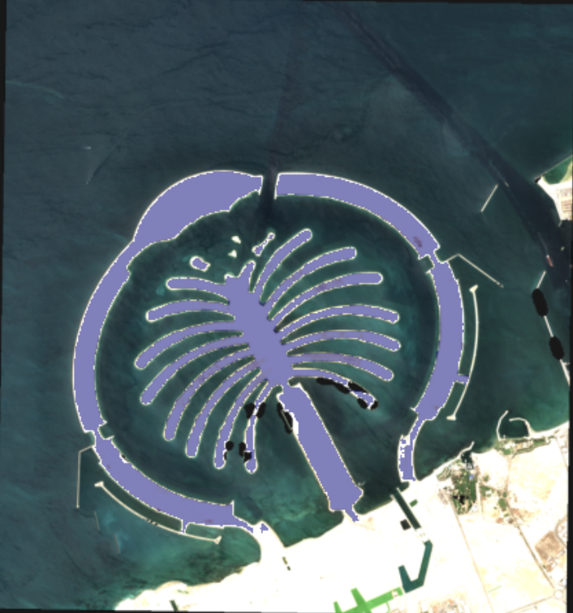

# Segment Anything for GeoTiff Images

This repository contains an interactive prompt segmentation using `Segment Anything Model`, built with Dash and Dash Leaflet.

## Key features

SAM allows segmenting objects with spatial prompts that are in a form of bounding boxes and points. Note that the model can work only with bounding boxes. Points can be used to better identify objects inside the bounding box by defining foreground and background pixels.

<div style="display: flex; justify-content: space-between;">
    
    
</div>

The user has two options:

1. Draw a bounding box on the map that will define the ROI. Then draw other bounding boxes and points to define objects of interests to be segmented.
2. Upload their own image and draw bounding boxes and points to define the objects of interest.
3. There is also the possibility to perform automatic segmentation of the whole image but it is less precise and reliable.

## Image format and size

The uploaded images must be georeferenced GeoTiff files. Please bear in mind that the images shouldn't be so large due to the limited hardware resources and for fluid visualization.

## Repository content

```markdown
.
├── Dockerfile
├── README.md
├── imgs
│   ├── img_1.png
│   └── img_2.png
├── app.proto
├── app_pb2.py
├── app_pb2_grpc.py
├── pyproject.toml
├── requirements.txt
├── serve.py
├── src
│   ├── assets
│   ├── sam
│   ├── app.py
│   ├── config.py
│   ├── sam_utils.py
│   └── utils.py
└── test-data
    └── T40RBN_20230607T064629_RGB.tif
```

## Local Development

- In a terminal, clone the repository

```powershell
git clone https://github.com/AlbughdadiM/depai-sam.git
```

- Go to the repository directory

```powershell
cd depai-sam-interactive
```

- If the files `app_pb2_grpc.py` and `app_pb2.py` are not there, generate them using

```powershell
python3.12 -m grpc_tools.protoc -I. --python_out=. --grpc_python_out=. app.proto
```

- Build the docker image

```powershell
docker build . -t depai-sam-interactive:v0.1
```

- Create a container from the built image

```powershell
docker run --name=test -v ./test-data:/data -p 8061:8061 -p 8062:8062 --env SHARED_FOLDER_PATH=/data depai-sam-interactive:v0.1
```

## Container Registry

- Generate a personal access token: Github account settings > Developer settings > Personal access tokens (classic). Generate a token with the `read:package` scope.

- In a terminal, login to container registry using

```powershell
docker login ghcr.io -u USERNAME -p PAT
```

- Pull the image

```powershell
docker pull ghcr.io/albughdadim/depai-sam-interactive:v0.1
```

- Create a container

```powershell
docker run --name=test -v ./test-data:/data -p 8061:8061 -p 8062:8062 --env SHARED_FOLDER_PATH=/data ghcr.io/albughdadim/depai-sam:v0.1
```
